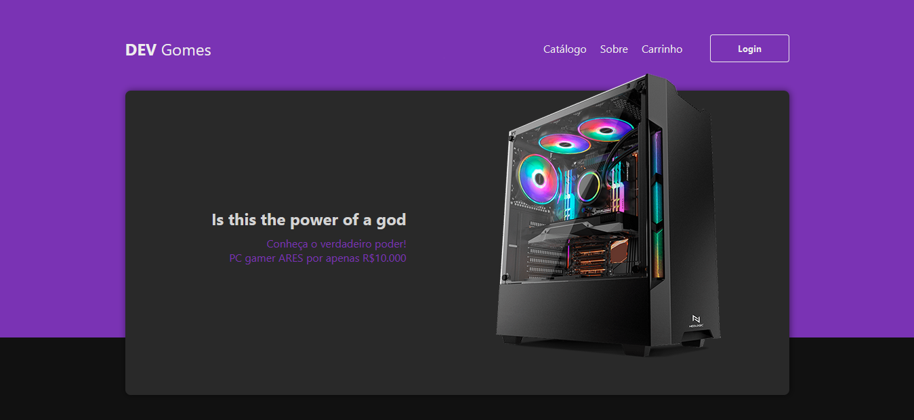
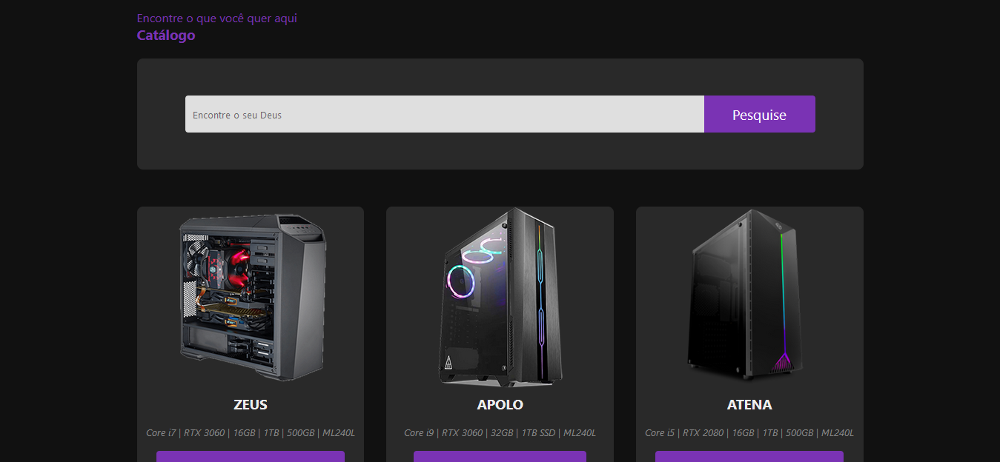
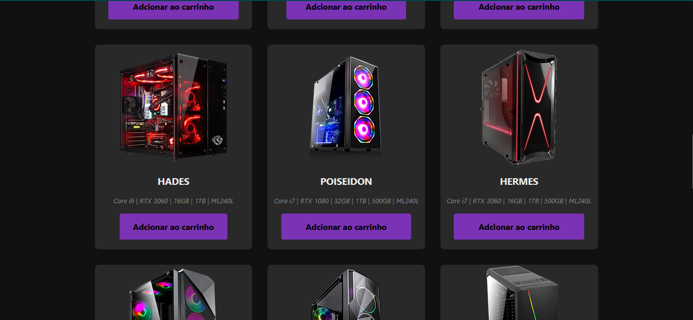
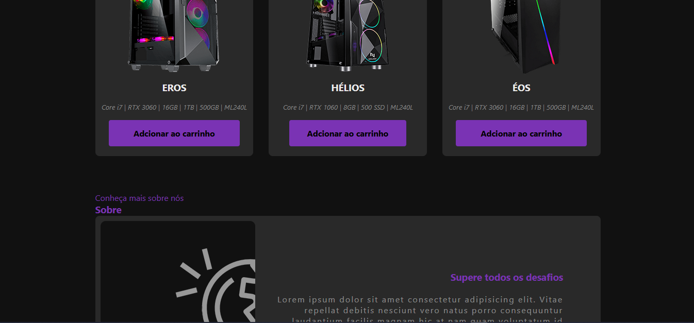
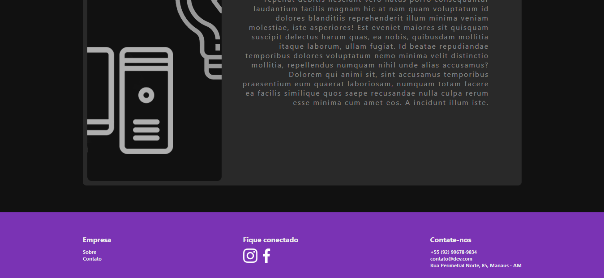

<h1>Catálogo - gamer</h1>

<h2>Sobre</h2>

 Basicamente é um catálogo de PC gamer, e cada PC tem um nome e configuração diferente, os nomes de todas as maquinas são de Deuses gregos. 

 ---

<h2>Prints</h2>

<h2>Requisitos para rodar o projeto</h2>
<lu>
    <li> VScode <a href="https://code.visualstudio.com/download" target="_blank" rel="external">baixar VScode</a>
</lu>

----

<h2>👩‍💻Tecnologias</h2>

<lu>
    <li> HTML5
    <li> CSS3
</lu>

---
Juan Gomes༼ つ ◕_◕ ༽つ <a href="https://github.com/juamgomes" target="_blank" rel="external">Github</a>

